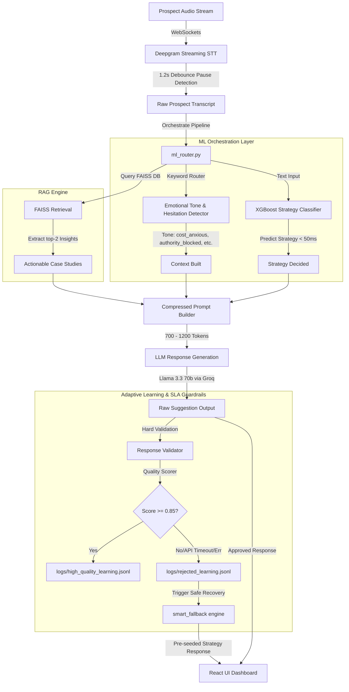

<!-- PROJECT SHIELDS -->
<div align="center">

[](https://opensource.org/licenses/MIT)
[]()
[](https://reactjs.org/)
[](https://fastapi.tiangolo.com/)
[](https://www.python.org/)
[](https://xgboost.readthedocs.io/)
[](https://github.com/facebookresearch/faiss)
[](https://vitejs.dev/)

</div>

<br />

<div align="center">
  <h1 align="center">✦ hexagon.ai</h1>
  <p align="center">
    <strong>The Future of High-Stakes Sales Intelligence</strong>
    <br />
    A real-time, hybrid ML/RAG-powered AI orchestrator that detects objections, classifies emotional states, applies psychological persuasion strategies, and closes deals.
  </p>
</div>

---

## 💎 The Vision

**hexagon.ai** is a state-of-the-art **Sales Co-Pilot** designed for high-pressure enterprise sales environments where every second and every word matters. 

Unlike standard call loggers or generic LLM-based sales coaches, Hexagon leverages a **decoupled Hybrid ML-LLM Architecture** to deliver high-fidelity, psychologically-backed response suggestions in real-time. By utilizing offline-trained, highly-optimized ML classifiers to pre-compute structural decisions (strategy, emotion, hesitation) under **50ms**, Hexagon eliminates the massive latency and cost overhead of relying solely on LLMs for conversation analysis. The LLM acts purely as a natural language generator, writing razor-sharp consultative copy powered by compressed prompts (700-1200 tokens) and high-speed FAISS vector retrieval.

---

## 🧠 System Architecture & Runtime Flow

Hexagon operates on a dual-engine architecture coordinating in real-time over persistent WebSocket channels:



---

## 🚀 Key Capabilities & Core Modules

### 1. Offline ML Prediction Layer (`ml/`)
* **Dual-Model Classifier:** Uses a robust `XGBClassifier` (offline training) with an automatic, reliable `LogisticRegression` fallback trained on structured conversational datasets (`strategy_training.jsonl`).
* **Microsecond Latency:** Features a custom dependency-free text preprocessing pipeline (`preprocess.py`) and a micro-tuned TF-IDF Vectorizer (`vectorizer.py`) that normalize text and generate numeric vector inputs in `<5ms`.
* **5 Canonical Strategies Classifed:**
  * `ROI_REFRAME`: Handles pricing & cost-related objections.
  * `RISK_REVERSAL`: Addresses delay, timeline, or postpone objections.
  * `STATUS_GAP`: Tackles ego or "we already have in-house tools" objections.
  * `DECISION_CONTROL`: Overcomes authority or "need partner/CFO approval" roadblocks.
  * `DIAGNOSTIC_QUESTION`: Bypasses skepticism and "AI hype" concerns.

### 2. FAISS Vector RAG Engine (`rag/`)
* **Vectorized Knowledge base:** Direct binary-loaded FAISS index (`faiss_index.bin`) matching prospect text against vector-embedded strategy playbooks and operational insights in real-time.
* **Strict Prompt Budgets:** Enforces a rigid `max_chunks: 2` retrieval limit to prevent prompt ballooning, ensuring context-rich yet highly compressed prompts of `700-1200` tokens.

### 3. Smart Fallback & SLA Guardrails
* **8-Second Strict SLA:** Monitors LLM API response times in real-time. If latency exceeds the 8.0-second limit or network failures occur, Hexagon automatically halts the request.
* **Psychologically-Aware Fallbacks:** Instantly serves custom fallback responses mapped to the prospect's predicted objection category and emotional tone, ensuring zero conversation drop-offs.
* **GPT Detox & Anti-Repetition:** Strips conversational filler, generic sales phrasing, and repetitive suggestions using strict validation filters and sequential difference matching.

### 4. Offline Adaptive Learning Loop (`ml/evaluation/`)
* **Quality Scoring & Hard Validation:** Every generated interaction is analyzed by a response validator and scored based on strategy alignment and emotional appropriateness.
* **Continuous Reinforcement Data:** Interactions scoring `>= 0.85` are written directly to `logs/high_quality_learning.jsonl` to build a localized high-performance sales corpus for subsequent model retraining, while low scoring runs are captured in `rejected_learning.jsonl`.

### 5. High-Status Response Energy Routing
* Dynamically adjusts conversational tone and perspective shifts using rule-based keyword routers mapping to:
  * `calm_authority`: High-status, grounded, outcomes-driven, never emotional.
  * `soft_challenge`: Exposes weak assumptions and applies consultative pressure gently.
  * `emotional_clarity`: Reduces confusion and handles hesitation without sounding therapeutic.
  * `composed_confidence`: Unfazed by dismissive or high-ego prospect attitudes.
  * `relaxed_guidance`: Natural, conversational, socially smooth, and intelligent.

---

## 🛠 Tech Stack

### Backend
* **Core Framework:** FastAPI (Python 3.10+)
* **Inference & Vectorization:** XGBoost, Scikit-learn, FAISS, Joblib, Pandas
* **AI Orchestration & LLM Client:** AsyncOpenAI (integrated with Groq Llama-3.3-70b-versatile)
* **Real-time Pipeline:** High-speed streaming WebSockets with Deepgram SDK
* **Database / Storage:** SQLite via SQLAlchemy ORM (for persistent call log archiving)

### Frontend
* **Core:** React 18 (Vite-powered, SPA architecture)
* **Animations:** GSAP (ScrollTrigger & physics-based timeline animations)
* **Physics & Micro-Interactions:** Matter.js for interactive dashboard physics
* **Icons & UI:** Lucide React, vanilla HSL-tuned CSS (custom glassmorphic theme)
* **State Management:** React Context API + Custom Hooks

---

## 📂 Project Structure

```text
Hexagon/
├── 📂 ml/                      # ML Intelligence & Classification Layer
│   ├── 📂 config/              # Strategy registers & canonical labels
│   ├── 📂 evaluation/          # Hard validators, quality scorers & learning filters
│   ├── 📂 inference/           # Real-time XGBoost/LogisticRegression prediction
│   ├── 📂 training/            # Model training & validation script
│   ├── 📂 utils/               # Ultra-fast preprocessing & text normalizers
│   └── 📂 vectorizers/         # TF-IDF sparse matrix tokenizers
├── 📂 backend/                 # FastAPI Backend Logic
│   ├── 📄 main.py              # Entry point & WebSocket server orchestrator
│   ├── 📄 ml_router.py         # Main ML & RAG orchestration logic
│   ├── 📄 requirements.txt     # Python dependencies
│   ├── 📂 services/            # Core business & real-time audio logic
│   │   ├── 🧠 sales_ai_engine.py # V4.2 psychofancy engine
│   │   ├── 🎙️ deepgram_stream.py # Deepgram real-time stream handler
│   │   └── 🔌 websocket_service.py # WebSocket session controller
│   └── 📂 routers/             # Standard API endpoints (auth, calls, leads)
├── 📂 frontend/                # React SPA Frontend (Vite)
│   ├── 📂 src/
│   │   ├── 📂 components/      # Glassmorphic UI & dashboard panels
│   │   ├── 📂 context/         # Real-time socket & auth global state
│   │   └── 📄 index.css        # Cream & Dark design tokens
│   └── 📄 package.json         # Javascript dependencies
├── 📂 rag/                     # Retrieval-Augmented Generation
│   ├── 📄 rag_engine.py        # FAISS search engine implementation
│   └── 📄 faiss_index.bin      # Binary serialized FAISS index
├── 📂 dataset/                 # Structured Training Corpus
│   └── 📄 strategy_training.jsonl # Behavioral sales conversation logs
├── 📂 models/                  # Serialized ML Artifacts
│   ├── 📄 strategy_model.pkl   # Trained XGBoost model
│   └── 📄 vectorizer.pkl       # Fitted TF-IDF Vectorizer
├── 📂 salesIntelligence/       # YAML configurations for ML and guardrails
├── 📂 yaml_folder/             # Behavioral prompt frameworks
├── 📂 logs/                    # Learning records & adaptive memory logs
└── 📂 test/                    # QA & Simulation Scenarios
```

---

## ⚡ Getting Started

### Prerequisites
* **Python 3.10+**
* **Node.js 18+**
* **OpenAI / Groq API Key** (Configured as `OPENAI_API_KEY`)
* **Deepgram API Key** (Configured as `DEEPGRAM_API_KEY`)

### Installation

1. **Clone the Repository**
   ```bash
   git clone https://github.com/glitchX-Harshit/sales-XAM-.git
   cd Hexagon
   ```

2. **Backend Setup & Model Training**
   ```bash
   cd backend
   python -m venv .venv
   
   # Activate virtual environment
   # On Windows:
   .venv\Scripts\activate
   # On macOS/Linux:
   source .venv/bin/activate
   
   # Install dependencies
   pip install -r requirements.txt
   pip install scikit-learn pandas joblib xgboost
   
   # Train the ML Strategy Model offline
   cd ..
   python -m ml.training.train_strategy_model
   
   # Launch the FastAPI server
   cd backend
   python main.py
   ```

3. **Frontend Setup**
   ```bash
   cd ../frontend
   npm install
   npm run dev
   ```

### QA & Local Simulation

You can test RAG retrieval speeds, model predictions, and entire engine latency locally by running:
```bash
# Test RAG retrieval and overall SLA latency
python test_rag.py

# Test sequential objection handling and strategy rotation
python test_pipeline.py
```

---

## 🎯 Contributing

We welcome contributions from the community! Feel free to raise issues, propose new psychological persuasion profiles, or optimize model architectures:

1. Fork the Project.
2. Create your Feature Branch (`git checkout -b feature/AmazingFeature`).
3. Commit your Changes (`git commit -m 'Add some AmazingFeature'`).
4. Push to the Branch (`git push origin feature/AmazingFeature`).
5. Open a Pull Request.

---

## 📄 License

Distributed under the MIT License. See `LICENSE` for more information.

---

<div align="center">
  <sub>Built with ❤️ by <b>Harshit</b> and the Hexagon Team</sub>
</div>